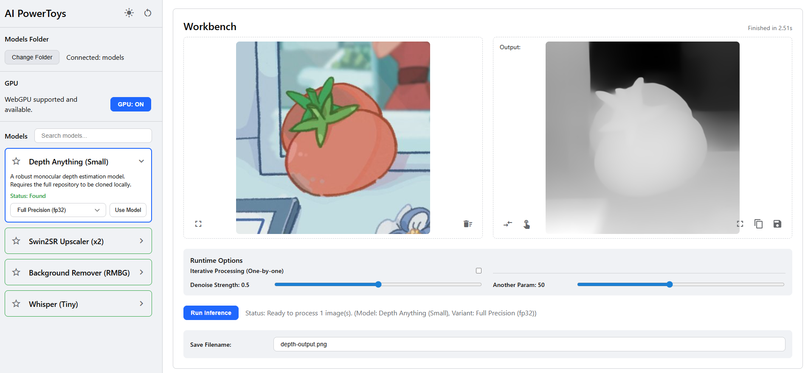
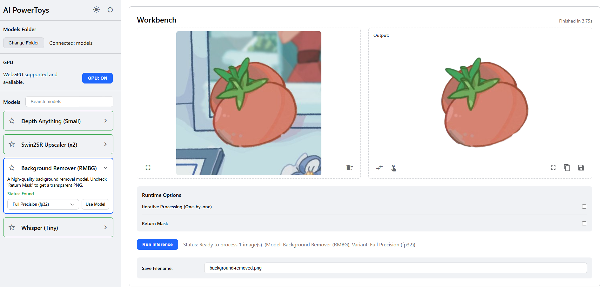
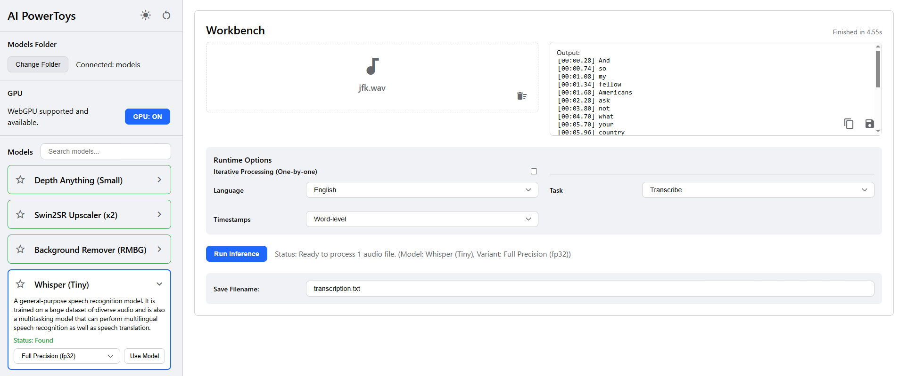

# AI PowerToys

AI PowerToys is a lightweight, browser-based interface for running powerful, open-source AI models directly on your machine. It leverages Transformers.js to execute ONNX models for a variety of tasks, including image processing and audio transcription, with a focus on local execution, privacy, and modularity.



> Depth Estimation task

Currently only support Chrome. WebGPU tested on Chrome Canary.

## ✨ Features

- **100% Local & Private:** All models run directly in your browser. Your data never leaves your computer.
- **GPU Acceleration:** Utilizes WebGPU for significant performance boosts where available.
- **File-Based Model Management:** Simply point the app to a local folder containing your downloaded ONNX models.
- **Extensible by Design:** Easily add new models or even entirely new AI tasks by creating simple configuration files.
- **Modern UI:** Clean, responsive interface with light and dark modes.

## 🚀 Getting Started

### Prerequisites

- [Node.js](https://nodejs.org/) (v18+ recommended)
- [npm](https://www.npmjs.com/) (or yarn/pnpm)
- A modern web browser with support for WebGPU (e.g., Google Chrome, Microsoft Edge).

### Installation & Running

1. **Clone the repository:**

    ```bash
    git clone https://github.com/your-username/ai-powertoys.git
    cd ai-powertoys
    ```

2. **Install dependencies:**

    ```bash
    npm install
    ```

3. **Run the development server:**

    ```bash
    npm run dev
    ```

    This will start the Vite development server, typically at `http://localhost:5173`.

### Setting Up Models

1. **Create a folder** on your computer to store your AI models (e.g., `C:\ai-models` or `~/ai-models`).
2. **Download models** from the Hugging Face Hub. Make sure to download all relevant `.onnx` and `.json` configuration files for each model.
3. In the AI PowerToys application, click the **"Connect Folder"** button and select the folder you created in step 1. The app will automatically detect compatible models.

The application can try to download the missing models for you, but it may face interruptions if the repository is too large. Then we recommend manually download via `git clone`.

---

## 🛠️ How to Add a New Model or Task

The application is designed to be easily extended. Here's how to add new functionality.

### 1. Adding a New Model (for an existing task)

To add a new model for a task that's already supported (e.g., another background remover):

1. **Download the Model:** Download the ONNX and JSON files for the model from Hugging Face and place them in a subdirectory inside your main models folder.

2. **Create a Manifest File:** Create a new `.json` file in the `public/modules/` directory (e.g., `new-background-remover.json`). This file tells the app about the model.

    ```json
    {
        "id": "user/model-name-on-hub",
        "name": "My New Background Remover",
        "author": "Model Author",
        "task": "image-segmentation",
        "description": "A description of what this model does.",
        "ui_components": {
            "workbench_input": "/components/workbench/image_input.html",
            "workbench_output": "/components/workbench/image_output.html"
        },
        "config_files": ["config.json", "preprocessor_config.json"],
        "default_filename": "removed-bg.png"
    }
    ```

    - **`id`**: The Hugging Face repository ID.
    - **`task`**: The crucial link to the task's logic (e.g., `image-segmentation`).
    - **`ui_components`**: Paths to the HTML components for the input/output UI.
    - **`config_files`**: A list of required JSON configuration files.

3. **Register the Module:** Add the path to your new manifest file in `modules.config.json`.

    ```json
    {
        "official_modules": [
            "/modules/existing-model.json",
            "/modules/new-background-remover.json"
        ]
    }
    ```

The application will now show your new model in the list.

### 2. Adding a New Task (e.g., "Text Summarization")

Adding a completely new *type* of task requires one extra step:

1. **Follow all steps for adding a new model.** Define the `task` name to be something new, like `"text-summarization"`.

2. **Create a Task Handler:** In the `workers/tasks/` directory, create a new file named after your task: `text-summarization.task.js`. This file must export a `postprocess` function that takes the raw output from the AI model and formats it for display.

    ```javascript
    // workers/tasks/text-summarization.task.js

    /**
     * @param {Array} output Raw output from a text2text-generation pipeline.
     * @returns {Promise<string>} The formatted summary text.
     */
    export async function postprocess(output) {
      // Example: [{ "summary_text": "This is the summary." }]
      if (output && output[0] && output[0].summary_text) {
        return output[0].summary_text;
      }
      return "Summarization failed.";
    }
    ```

The inference worker will automatically find and use this new handler based on the `task` name in your model's manifest. You may also need to create new UI components in `public/components/workbench/` if the task requires a different input/output format than what already exists.

---



> Background removal task



> Speech to text task